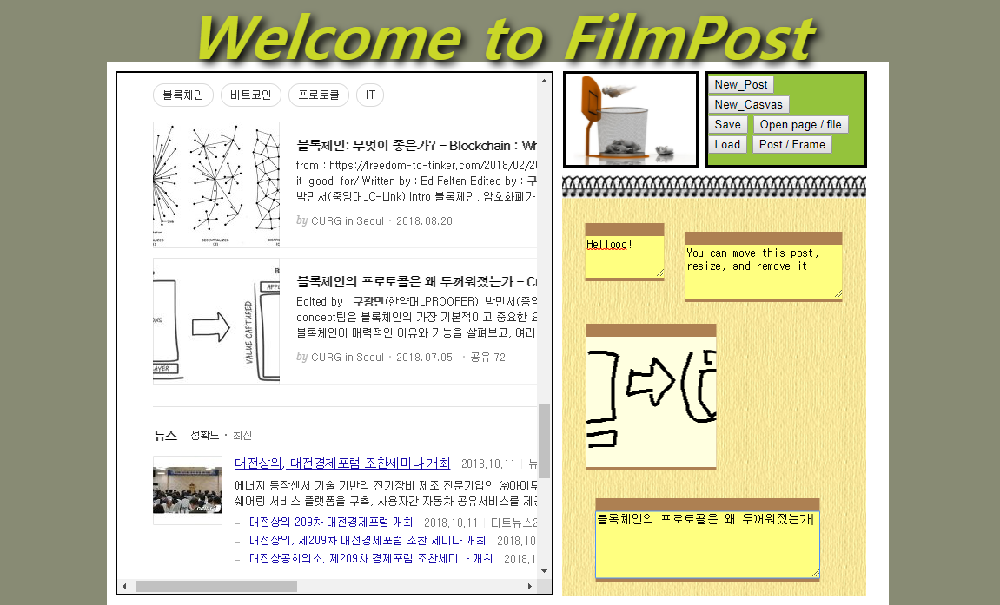

# FilmPost
#### A program memorizing text or drawing like Post-it on web browser written by HTML, JS, CSS  

### Description
This is a Post-it program on web browser. With a frame which is able to be moved by dragging, you can write some text or draw something. This "Post-it" can be added or removed, and saved or loaded from _**local storage**_ as well. Finally, this program loads and shows a URL, including image, textfile, pdf, to need for your memorizing.  

### Usage
Execute _post.html_  

* **New_Post**  
"Drag" this button into the memo pad to create a new text memo.  

* **New_Casvas**  
"Drag" this button into the memo pad to create a new drawing memo.  
( Note : "Casvas" should be a typo :p, which means "Canvas" )  

* **Save**  
Click to store your memo.  

* **Load**  
Click to load the memo you saved.  

* **Open page / file**  
Click and type an URL to load  
( Note : Most of remote URL today is not able to browse :( )  

* **Post / Frame**  
If Click this button, whether you can click an hyperlink, select text, or locate other position of what you load...  
Don't care of it :) I've forgotten the reason I made this.  

  
  

